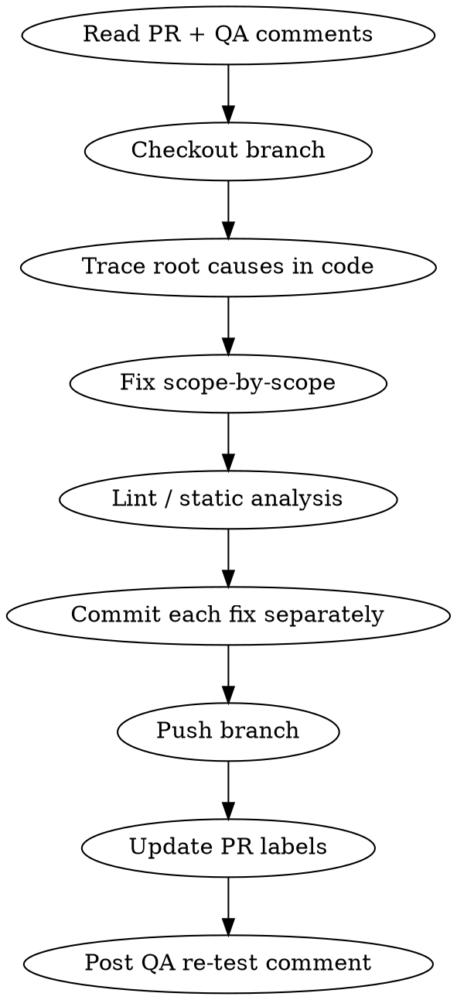

# Fix PR QA Failures

> **Model note:** This skill traces non-obvious root causes across PHP, JS, and CI — run on `sonnet` or `opus`. Do not downgrade to `haiku`; cause identification requires reasoning across multiple files.

## When to use

- "QA marked my PR as Testing Failed", "fix the bugs in QA comments", "address QA feedback".
- "A PR has a 'Testing Failed' label", "QA left comments saying features are broken".
- "Trace the root cause of a QA-reported bug and fix it with scoped commits".
- "Post a QA re-test comment after fixing the reported issues".

**Not for:** Writing new features or fresh code — use `wp-github-flow`. Setting up a CI pipeline from scratch — this skill triages failures in existing CI.

## Overview

Full workflow for diagnosing and fixing bugs reported by QA on an open PR. Starts from the GitHub PR URL, ends with labels updated and a QA re-test comment posted.

## Supporting files

- `scripts/fetch-pr-context.sh <pr> [owner/repo]` — Step 1 in one command: prints
  PR metadata, labels, and the full QA comment thread (newest last).
- `references/root-cause-patterns.md` — catalog of recurring bug patterns
  (symptom → cause → detect → fix). **Read before tracing; append after.**
- `references/qa-comment-template.md` — the Step 8 re-test comment template + rules.
- `references/github-actions-wp-matrix.md` — PHPUnit/PHPCS/PHPStan workflow configs, PHP×WP version matrix, caching, and CI failure triage.

## Workflow



## Step 1 — Read PR and QA comments

```bash
scripts/fetch-pr-context.sh <number> <owner/repo>
```

Or manually:
```bash
gh pr view <number> --repo <owner/repo> \
  --json title,body,author,baseRefName,headRefName,state,labels
gh pr view <number> --repo <owner/repo> --json comments,reviews
```

Collect:
- Which features QA says are broken (exact words) — read the **latest** QA comment; across re-fix rounds some features get confirmed fixed while others stay broken
- Which features QA confirms work (do not regress these)
- Label currently on the PR (`Testing Failed`, `Need Testing`, etc.)

## Step 2 — Checkout the branch

```bash
git fetch origin <branch>
git checkout <branch>
```

If the repo is not cloned locally, find it under `wp-content/plugins/` or the relevant project path.

## Step 3 — Trace root causes

Start from the action/hook/controller that handles the broken feature.

**First, scan `references/root-cause-patterns.md`** — most QA failures match a
known pattern (array-cast-to-1, hook-fired-in-one-path, chart-renders-raw-id,
duplicate-component-drift, default-margin-misalignment). It gives symptom →
detect → fix for each.

Key questions when no known pattern matches:
1. What hook/action fires this email / feature? Where is it fired
   (`grep -rn "do_action( 'hook'"`)? Is it reached on EVERY path to that state?
2. Are any model `get_*()` returning wrong values after `load()` mutates state?
3. (Frontend) Is a lib component rendering a raw key because no label/tooltip
   render prop was passed? Does a sibling surface have a fix this one lacks?

When you trace a NEW non-obvious cause, append it to the catalog before moving on.

## Step 4 — Fix scope-by-scope

One logical bug = one commit. Do not bundle unrelated fixes.

After each fix, verify the changed files:
```bash
# PHP
vendor/bin/phpcs app/Models/ChangedFile.php

# JS/TS lint
yarn lint <files>

# Frontend changes: the build is the real proof (lint/tsc may be noisy)
yarn build          # or: node_modules/.bin/wp-scripts build
```

**If the tooling env is broken** (corepack lockfile error, eslintrc circular
config, tsc halting on deprecations — all common on machines where global
toolchain versions drifted from the lockfile), fall back to the local binary:
```bash
node_modules/.bin/eslint <files>
node_modules/.bin/tsc --noEmit --ignoreDeprecations 6.0
node_modules/.bin/wp-scripts build
```

**Separate pre-existing errors from yours.** A noisy lint/tsc run (e.g. 60+
errors) is usually env/version mismatch, not your change. Confirm none of the
errors reference your changed files. Pre-existing errors in unrelated files are
OK to leave — only fix what your change introduced. The build compiling
successfully is the strongest signal a frontend fix is sound.

## Step 5 — Commit each fix

```bash
git add app/Path/To/ChangedFile.php
git commit -m "$(cat <<'EOF'
fix(scope): short imperative summary

Root cause: <what was actually wrong>
Fix: <what was changed and why>
EOF
)"
```

Use `fix(scope):` prefix. Scope = the subsystem (referral, transaction, email, spa, etc.).

**Before committing built assets:** check whether `build/` (or `dist/`) is
tracked or ignored, and match the repo's convention — don't commit generated
output if prior PR commits were source-only:
```bash
git check-ignore build/        # prints "build/" if ignored → commit source only
git show --stat <prev-commit>  # confirm what prior fix commits included
```

## Step 6 — Push

```bash
git push origin <branch>
```

No new PR needed if the branch already has an open PR — the new commits update it automatically.

## Step 7 — Update labels

Only swap if the current label is wrong for re-test. If the PR is **already**
`Need Testing` (a re-fix round on a still-open testing cycle), leave it — no
change needed. Swap only when moving off a terminal state:
```bash
# See available labels first
gh label list --repo <owner/repo>

# Only if currently "Testing Failed"/"Testing Ongoing":
gh pr edit <number> --repo <owner/repo> \
  --remove-label "Testing Failed" \
  --add-label "Need Testing"
```

## Step 8 — Post QA re-test comment

Use `references/qa-comment-template.md`. Comment must include all four:

| Section | Content |
|---|---|
| Summary table | Each broken feature → root cause → fix (1 line each) |
| Step-by-step test instructions | Numbered steps per feature, specific UI path |
| Regression check | Ask QA to re-verify previously working items |
| Commit SHAs | Latest fix commits so QA knows what to test against |

```bash
gh pr comment <number> --repo <owner/repo> --body "$(cat <<'EOF'
<filled-in template from references/qa-comment-template.md>
EOF
)"
```

## Common Mistakes

| Mistake | Fix |
|---|---|
| Bundling multiple bug fixes in one commit | One logical fix per commit — easier to revert and for QA to trace |
| Ignoring pre-existing lint errors | Only fix errors your changes introduced |
| Opening a new PR when branch already has one | Just push; the existing PR updates automatically |
| Vague QA comment ("fixed bugs") | Name each broken feature, give exact UI steps |
| Forgetting regression check in QA comment | Always ask QA to confirm previously passing items still pass |
| Not verifying `do_action` call sites | Check ALL places a hook should fire, not just the obvious one |
| Skipping build on frontend PRs | Lint/tsc may be broken or noisy; `yarn build` compiling is the real proof |
| Treating noisy lint/tsc as your fault | 60+ errors = env/version drift. Confirm none name your files, then proceed |
| Committing gitignored `build/` output | Check `git check-ignore build/`; match prior commits (usually source-only) |
| Swapping a label that's already correct | If already `Need Testing` on a re-fix round, leave it |
| Reading only the first QA comment | Read the latest — features confirmed fixed in round 1 shouldn't be re-touched |
